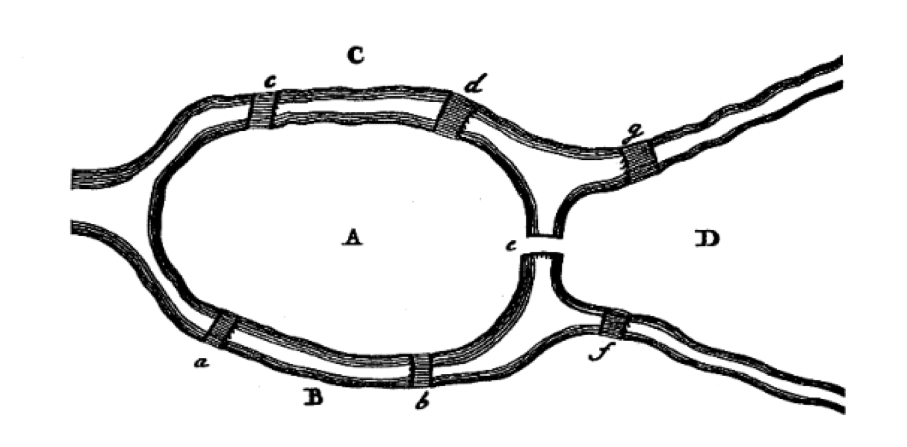

## Graf Teorisinin Tarihçesi: Königsberg'in Yedi Köprüsü

Graf teorisi, 18. yüzyılda İsviçreli ünlü matematikçi **Leonhard Euler**'in çözdüğü meşhur bir bulmaca ile doğmuştur: **Königsberg'in Yedi Köprüsü** problemi.

Königsberg şehri (günümüzde Rusya'ya bağlı Kaliningrad), Pregel Nehri'nin her iki yakasını ve nehir üzerindeki iki büyük adayı birbirine bağlayan yedi köprüye sahipti. Şehir sakinleri şu sorunun cevabını merak ediyordu:

> *"Şehirdeki herhangi bir noktadan başlayıp, yedi köprünün her birinden tam olarak bir kez geçerek tüm şehri dolaşmak ve başlanılan noktaya geri dönmek mümkün müdür?"*

Euler, 1736 yılında bu problemin imkansız olduğunu matematiksel olarak kanıtladı. Problemi çözerken, karaları **düğümlere (nodes / vertices)**, köprüleri ise bu karaları birbirine bağlayan **kenarlara (edges / links)** dönüştürdü. Böylece tarihteki ilk grafı modelledi.

Euler, bir düğümden geçip gitmek için o düğüme bir kenardan girip diğer kenardan çıkılması gerektiğini fark etti. Dolayısıyla, başlangıç ve bitiş düğümleri hariç, tüm düğümlerin bağlı olduğu kenar sayısının **çift sayı** olması gerekiyordu. Königsberg'deki karaların kenar sayıları incelendiğinde sırasıyla 3, 3, 3 ve 5 olduğu görüldü. Bu durum, böyle bir yürüyüşün imkansız olduğunu gösteriyordu.

Bu problem ve Euler'in sunduğu çözüm yöntemi, modern **Graf Teorisi** ve **Topoloji** bilim dallarının resmi başlangıcı olarak kabul edilir.

 :::

------------------------------------------------------------------------

## Graf'lara Giriş

Bir Graf, $G=(V,E)$ şeklinde ifade edilen bir demettir; burada $V$, köşelerden oluşan sonlu bir kümedir ve $E$, $V$'nin tek veya iki elemanlı alt kümelerinden elemanlar içeren kümelerden oluşan bir koleksiyondur. $V$ düğümler (vertices, nodes) ve $E$ kenarlar (edges) olarak adlandırılır.

------------------------------------------------------------------------

NetworkX kütüphanesini kullanarak boş bir yönsüz graf oluşturarak başlayalım.

## İlk Grafı Oluşturma

İlk olarak NetworkX kütüphanesini içe aktarıyoruz ve boş bir `Graph` nesnesi oluşturuyoruz:

```{python}
import networkx as nx

# Boş bir yönsüz graf oluşturma
G = nx.Graph()

print(type(G))
```
```{python}

```

------------------------------------------------------------------------

## Düğümler

Oluşturduğumuz `$G$` grafına düğümler eklemenin farklı yolları vardır. NetworkX oldukça esnektir; Python'da **hashable** (yani değiştirilemez ve benzersiz şekilde indekslenebilir) olan neredeyse her nesne bir düğüm olabilir.

> **None Nesnesi İstisnası:** Python'ın `None` nesnesi NetworkX'te bir düğüm olarak **kullanılamaz**. Birçok fonksiyonun isteğe bağlı parametre atamalarında kontrol amaçlı kullanıldığı için kütüphane tarafından düğüm olarak kabul edilmez.

### 1. Tek Bir Düğüm Ekleme

`add_node()` metodunu kullanarak tek bir düğüm ekleyebiliriz:

```{python}
G.add_node(1)
```

### 2. Liste veya İteratör ile Birden Fazla Düğüm Ekleme

`add_nodes_from()` metoduna bir Python listesi, kümesi veya aralığı (`range`) göndererek toplu düğüm eklemesi yapabiliriz:

```{python}
# Bir liste ile düğüm ekleme
G.add_nodes_from([2, 3])

# Bir range nesnesi ile düğüm ekleme
G.add_nodes_from(range(4, 7))

# Mevcut düğümleri görelim
print("Graftaki Düğümler:", G.nodes())
```

### 3. Diğer Graflardan Düğüm Çekme

Başka bir grafın düğümlerini de doğrudan grafımıza ekleyebiliriz:

```{python}
# 10 düğümlü bir yol grafı (path graph) oluşturalım
H = nx.path_graph(10)

# H grafının düğümlerini G'ye ekleyelim
G.add_nodes_from(H)

print("G'nin yeni düğümleri:", G.nodes())
```

> **Yol Grafı:** Düğümlerin ardışık bir şekilde, kenarlarla tek bir hat üzerinde birleşmesiyle oluşan en basit ve temel graf türlerinden biridir.

------------------------------------------------------------------------

## Kenarlar

Kenarlar düğümler arasındaki ilişkileri gösterir. Tıpkı düğümlerde olduğu gibi kenarları da tek tek veya toplu halde ekleyebiliriz.

### 1. Tek Bir Kenar Ekleme

`add_edge()` metodunu kullanarak iki düğüm arasına bir bağlantı atarız:

```{python}
G.add_edge(1, 2)
```

### 2. Liste veya İteratör ile Birden Fazla Kenar Ekleme

`add_edges_from()` metodu ile bir tuple listesi göndererek toplu bağlantılar oluşturabiliriz:

```{python}
G.add_edges_from([(1, 3), (2, 4), (3, 5)])

print("Graftaki Kenarlar:", G.edges())
```

:::: concept-card
::: concept-title
Otomatik Düğüm Oluşturma Özelliği
:::

> NetworkX'te henüz grafa eklenmemiş düğümler arasına bir kenar eklerseniz, kütüphane bu düğümleri **otomatik olarak** tespit eder ve grafa ekler. Düğümleri önce ayrı olarak eklemenize gerek yoktur.
::::

Bunu bir örnekle görelim:

```{python}
# 99 ve 100 adında düğümlerimiz henüz yok
print("99 düğümde var mı?:", 99 in G)

# Ancak doğrudan aralarında kenar tanımlıyoruz
G.add_edge(99, 100)

# Şimdi kontrol edelim
print("99 düğümde var mı?:", 99 in G)
print("100 düğümde var mı?:", 100 in G)
print("Yeni kenarlar:", G.edges())
```

------------------------------------------------------------------------

## Temizleme

Grafı tamamen boşaltmak istiyorsak `clear()` metodunu çağırabiliriz. Bu işlem tüm düğümleri ve kenarları siler:

```{python}
# Grafı temizle
G.clear()

print("Düğümler:", G.nodes())
print("Kenarlar:", G.edges())
```

------------------------------------------------------------------------
